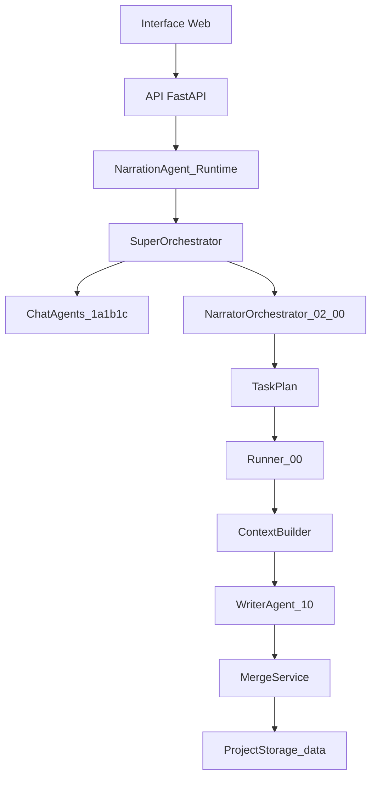

# Architecture applicative - narration_agent

## Objectif
Fournir un runtime applicatif pour executer la logique de `sandbox_agents/agent_architecture`
avec des appels LLM, des plans de taches, et une gestion des states N0-N5.

## Modules applicatifs (app/narration_agent)
- `llm_client.py` : wrapper LLM unique (model selection, execution).
- `agent_factory.py` : resolution des agents par role + prompts.
- `context_builder.py` : construction des `context_pack` (cible + contexte).
- `narrator_orchestrator.py` : generation du `task_plan` pour N0-N5.
- `task_runner.py` : execution des taches (sequentiel/parallele).

## Dependances applicatives
- `app/utils/project_storage.py` : lecture/ecriture des states N0-N5.
- `sandbox_agents/agent_architecture/*` : specs et schemas (source de verite).
- `sandbox_agents/agent_architecture/10_writer_agent/context_pack_structure.json`.
- `sandbox_agents/agent_architecture/02_narration/02_00_task_plan_structure.json`.
- `app/narration_agent/super_orchestrator/*` : specs couche 0.
- `app/narration_agent/chat_agent/*` : specs couche 1 (1a/1b/1c).

## Flux principal (creation projet vide)
1) L'utilisateur cree un projet (dossier `data/{project_id}/metadata`).
2) L'app initialise N0-N5 vides (copies des `state_structure_n*`).
3) Le super-orchestrateur lance 1a -> 1b -> 1c tant que `missing` non vides.
4) L'orchestrateur narration produit un `task_plan`:
   - tache initiale d'identification du projet
   - N0 par sections (production_summary, deliverables, art_direction, sound_direction)
   - puis N1, N2, N3, N4, N5
5) Le runner execute les taches:
   - Context Builder -> `context_pack`
   - Writer -> `target_patch`
   - Merge applicatif -> mise a jour du state

## Interface writer (context_pack)
- Le writer ne voit que la section cible (`target_path`) et son contexte.
- Le writer retourne uniquement `target_patch`.
- Le merge applicatif applique la section et met a jour `updated_at`.

## Memoire de chat
- Stockee sur disque dans `data/{project_id}/chat_states/{session_id}.json`.
- Utilisee par le service `app/narration_agent/chat_memory_store.py`.
- Les sessions existantes dans `chat_memory/` sont migrees automatiquement et supprimees.

## Mapping task_plan -> runner
- `task_plan` (02_00) est emballe dans `runner_input.task_plan_payload`.
- `execution_mode` est deduit des dependances.

## Diagramme

